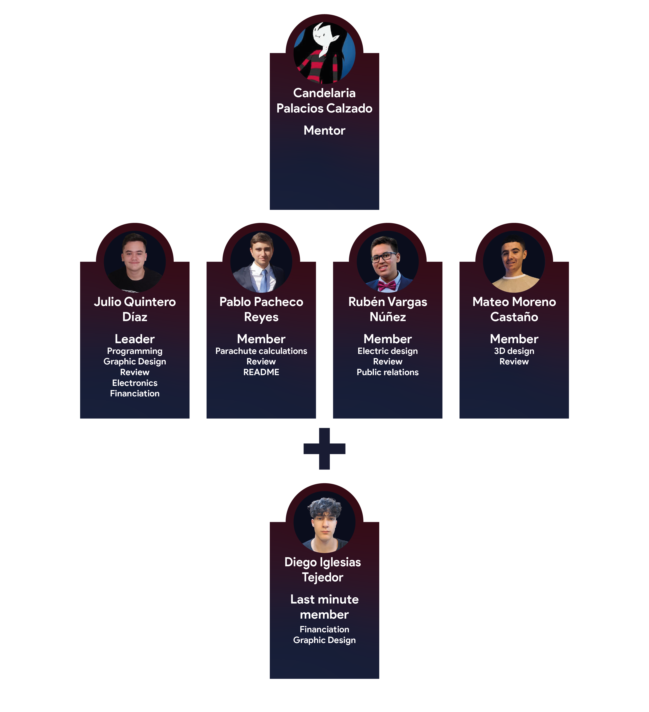

# CanSat WB
> This project called CanSat consist of making a little satellite with the shape of a can that needs to fulfil two important missions, the Primary Mission that every team needs to do and the Secondary Mission where every team can choose what they want their CanSat to do. In this project there has to be teams of four people minimum and they have to complete the requirements and make their own CanSat. Once the CanSat is done and has gone under testing, the CanSat will be launched inside a rocket a thousand meters up high and it will record the data that will be sent to the team in the Earth Station. Our school, IES Wenceslao Benitez encouraged us to participate in this project and that is what our team did.

## Table of contents
* [Info about our CanSat Project](#info-about-our-CanSat-Project)
* [Primary Mission](#primary-mission)
* [Secondary Mission](#secondary-mission)

## Info about our CanSat Project
In our CanSat Project we had to fulfil the requirements of the Primary mission and think of what to do for our secondary mission, also we needed to find the necessary sensors, equipment and materials to make our CanSat. In the next section the Primary Mission and our Secondary Mission will be explained.

## Primary Mission
The objective of the Primary Mission is to measure two parameters while the CanSat descends, which are pressure and temperature. The gathered data is transmitted to the Earth Station via telemetry during the descent of the CanSat. We have chosen the UNO Arduino board as our main hardware component, as our Arduino language program (c/c++) and as vscode development environment.

## Secondary Mission
In this case, the Secondary Mission is of our choice and decided by our group. Our idea for the Secondary Mission came up as a modification of a previous idea we decided not to use, the objective is to identify the increase of gas emissions of greenhouse effect in landfills, industries, overcrowded cities and other danger zones that harm the environment and so it’s above the imposed in the Paris agreement, giving respect to the goal of this convention: keeping global warming at a level below 2ºC and try to limited as much as possible before it reaches 1.5ºC

## Team

