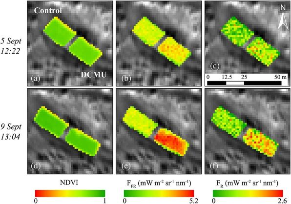

# CanSat WB
> This project called CanSat consist of making a little satellite with the shape of a can that needs to fulfil two important missions, the Primary Mission that every team needs to do and the Secondary Mission where every team can choose what they want their CanSat to do. In this project there has to be teams of four people minimum and they have to complete the requirements and make their own CanSat. Once the CanSat is done and has gone under testing, the CanSat will be launched inside a rocket a thousand meters up high and it will record the data that will be sent to the team in the Earth Station. Our school, IES Wenceslao Benitez encouraged us to participate in this project and that is what our team did.

## Table of contents
* [Info about our CanSat Project](#info-about-our-CanSat-Project)
* [Primary Mission](#primary-mission)
* [Secondary Mission](#secondary-mission)
* [Our team](#team)
* [Libraries] (#libraries-used)

## Info about our CanSat Project
In our CanSat Project we had to fulfil the requirements of the Primary mission and think of what to do for our secondary mission, also we needed to find the necessary sensors, equipment and materials to make our CanSat.

## Primary Mission
The objective of the Primary Mission is to measure two parameters while the CanSat descends, which are pressure and temperature. The gathered data is transmitted to the Earth Station via telemetry during the descent of the CanSat. We have chosen the UNO Arduino board as our main hardware component, as our Arduino language program (c/c++) and as vscode development environment.

## Secondary Mission
From the begining, the idea was to examine the zone's vegetation from the satellite. In order to do that, we would measure the plant's photosintesis efficiency, based on the chlorophyll fluorescence that these emit, with that we could determine how healthy forest biomes such as Green zones, forest, natural reserves... However, after an exhaustive investigation about this studio, we denied the idea due to the complexity for finding sensors that adapt to our maximum budget imposed in the bases of this competition. So, even though we opt to use the MQ sensor, the objective would still be mainly based on the environment: Identify increased emissions of green house effect gases in landfills, industries, busy cities and other tipe of danger zones that harm the environment and that they are above the imposed ones in the París agreement. All of that so it can be reduced when detected. How the data will be graphed and represented will be amplified in section 6.
This idea can be extrapolated in different ways. First, even if we use the MQ sensors that have poor resolution, espectrometers of high image resolution could be used (high-resolution imaging spectrometer) so these variations could be observed from earth orbit. An example to this would be the Iris satellite from GHGSat, that can observe high concentrations of methane.

At the same time, sensors that measure the concentration of chlorophyll fluorescence could be used, instead of those that measue green house effect gases. This extrapolation would be connected with our first idea.

Last thing, supposing that the CanSat is a space satellite, it could be used to investigate the atmosphere of other planeta and check for the presence of any gases that promote life, for both alíen and future posible human colonies.

## Team
* Julio Quintero Díaz
* Diego Iglesias Tejedor
* Pablo Pacheco Reyes
* Rubén Vargas Núñez
* Mateo Moreno Castaño

## Libraries Used
Technologies and libraries used in the CanSat code. Most of them can be installed from the library manager of the Arduino IDE.
* [Adafruit BMP280](https://github.com/adafruit/Adafruit_BMP280_Library)
* SPI 
* SD 
* SoftwareSerial
* [TinyGPS](https://github.com/mikalhart/TinyGPS)
* [MQ135](https://github.com/GeorgK/MQ135)
